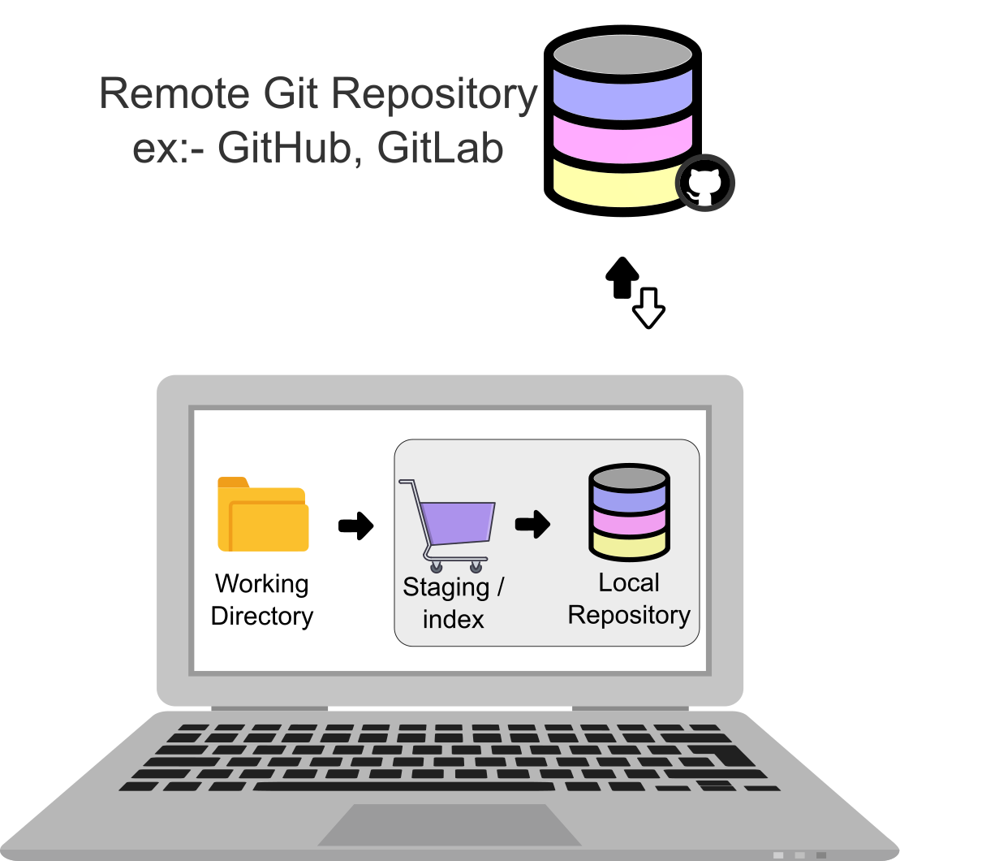

# How Git Works

## Git Architecture

The whole concept of version control is to let multiple developers work on a single project. So there is a git central system \(git remote repository\(repo\) github, gitlab,etc\) where project source saved. And each developer will push their code changes from their computer to the git remote repository and also pull other developer code \(code pushed by other developers\) from remote repository to their  computers.


 To connect from your computer to this remote repository you need [git client](https://github.com/git-guides/install-git) on your computer. There are few GUI clients aswell, but we will only cover the command line CLI here. You can install [git client from here](https://github.com/git-guides/install-git).


## Git Local System Architecture

**This is the most important step in understanding git.**

Most of the other version controls before Git worked as follows.

As a developer you will write code using code editors like Visual Studio Code, Eclipse.. save those files\(.js .java .html etc files\)  in your local computer and then push those to the remote repository. This is true for git also but there are couple more steps with git.

Unlike other version control systems Git structures local data/files into 3 layers. 

Working Directory  ---&gt;    Staging\(or Index\)   ---&gt;   Local Repository  =====&gt; Remote Repository





Working directory is the file system where you edit files using Visual Studio Code/Notepad or other IDE's.



~~For visualization you can think of these as 3 different folders. Working Directory is the only thing which is accisible to edit with your editors like Visual Studio Code or notepad etc and push that code to remote-repository. This is how it is done.~~

Lets say you implemented a new feature and for that you modified 3 files. Among these 3 files only 2 files are really required, the 3rd file is just temporariy change for testing or debugging purpose which you don't want to push into git repository. You will select these 2 files and add them to staging area. Staging is like a basket \(Imagine you are going to shopping mall where you pick different items and put all of them into your shopping cart\). 

```
$ git add *
```

Once you add the required files you will push them to Local Repository \(Remember this is the local repository not the remote repository\).

When you clone a remote git repository, that remote code is copied into your 'Local Repository' and also it is copied into your 'Working Directory' \(Staging is empty for freshly cloned projects\).

Note that your your local repository is not the same as your working directory. So when you write code and save, it will be saved in your working directory. Then from that working directory you will move these files into 'Staging' layer. From staging layer you will move to 'Local Repository'. Remember all these changes happen only inside your computer, code is not moved to remote git repository.

#### Why do we need this multiple layers ?

Git maintains history of code pushed. You can imagine all files you changed for a particular bug fix or a new feature will stay in the git history as package. Each of the package will have a \(commit id\), you can also name them as a TAG.

There are few advantages of having them in layers. Imagine while you are working on a new feature you found a minor bug. After implementing the new feature and fixing the bug, its better to have two commits in the git history.

 When you are putting all these features in the git history how do you want to see them? you can push all feature changes and bug as one package. This way you can see all that day changes as one package in git history \(denoted by a name\). Or you can package all new feature changes as one and all bug fix related things as another package. With this approach you will see git history having two boxes, one with new features and other with bug fixes.

----- Diagram ----


